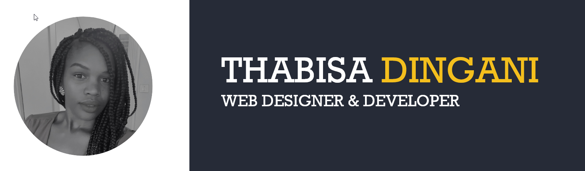

---

### Hi there 👋

I am a passionate Frontend Developer with a practical “can-do” 💪 attitude. Thanks to my creativity 🎨, I'm always able to solve problems, both personal and technical.
I am a natural communicator 📢 who easily connects with others.
My current areas of interest include UI/UX, SEO, and Frontend Development💻.

 

### MY EDUCATION 📚

🏫**Arteveldehogeschool**

⏳*2020-Now*

- Associate Degree in Computer Programming. 

🏫**UGent**

⏳*2019-2020*

- Voortraject Hoger Onderwijs voor Anderstaligen.
  
 

### MY SKILLS 🔔

|**Soft Skills**    |              |     |**Hard Skills**   |             | 
|:------------------|:------------:|:---:|:-----------------|------------:|
|Creativity         |🌕🌕🌕🌕🌗  |     |HTML/CSS         |🌕🌕🌕🌕🌗 | 
|Problem Solving    |🌕🌕🌕🌕🌗  |     |WordPress        |🌕🌕🌕🌕🌑 |    
|Flexibility        |🌕🌕🌕🌕🌑  |     |UI/UX design     |🌕🌕🌕🌕🌑 |     
|Optimism           |🌕🌕🌕🌕🌑  |     |Sass/Scss        |🌕🌕🌕🌗🌑 |     
|Communication      |🌕🌕🌕🌕🌑  |     |JavaScript       |🌕🌕🌕🌗🌑 |   
|Teamwork           |🌕🌕🌕🌕🌑  |     |JS-Frameworks    |🌕🌕🌕🌗🌑 | 
                                                                           

 

### LANGUAGES AND TOOLS 🛠️

 

### MY GITHUB STATISTICS 📈

 

 

 

### EXTRA INFORMATION 🦄

* 💬**Languages:**

     * English: (Very Good)
     * Dutch: (Good)

* 🎭**Hobbies:**

   * My Hobbies include reading, sketching websites, aerobics and yoga.

----

> 📧 <thabisad6@hotmail.co.uk> • ☎️ 0478570549  • 🏡 Eeklo, 9900 
> 
> 
> 
>  

